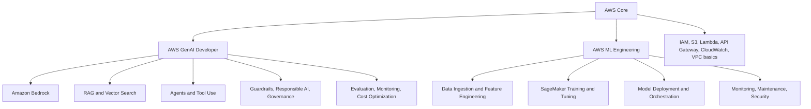

# Kiến Trúc Kiến Thức

## Bản Đồ Tổng Thể

## Lớp 1: AWS Core

Cần nắm:

- IAM roles, policies, least privilege.
- S3 bucket, versioning, encryption, lifecycle.
- Lambda runtime, timeout, memory, environment variables.
- API Gateway request/response flow.
- CloudWatch logs, metrics, alarms.
- KMS và encryption basics.

Không cần đi quá sâu vào networking nâng cao, nhưng cần hiểu security group, private/public access và endpoint ở mức ứng dụng.

## Lớp 2: GenAI Developer

Cần nắm:

- Foundation model selection.
- Prompt engineering: instruction, context, examples, constraints.
- Embeddings và semantic search.
- RAG pipeline: ingest, chunk, embed, retrieve, generate, cite.
- Bedrock Knowledge Bases.
- Agents: action group, tool calling, orchestration.
- Guardrails: harmful content, PII, topic policy, blocked response.
- Evaluation: relevance, groundedness, hallucination, toxicity, latency, cost.

## Lớp 3: ML Engineering

Cần nắm:

- Data formats: CSV, JSON, Parquet.
- ETL basics: Glue, Athena, S3.
- Train/test split, leakage, imbalance, missing data.
- Metrics: accuracy, precision, recall, F1, ROC-AUC, RMSE.
- SageMaker notebooks/jobs/endpoints.
- Model Registry và model versioning.
- Batch vs real-time inference.
- Monitoring data drift/model drift.

## Lớp 4: Production Thinking

Mỗi câu hỏi thiết kế nên tự hỏi:

- Dữ liệu nằm ở đâu?
- Ai có quyền truy cập?
- Model nào phù hợp về cost/latency/quality?
- Nếu output sai, mình phát hiện bằng cách nào?
- Nếu chi phí tăng, mình tối ưu điểm nào?
- Nếu prompt bị tấn công, hệ thống phòng vệ ra sao?
