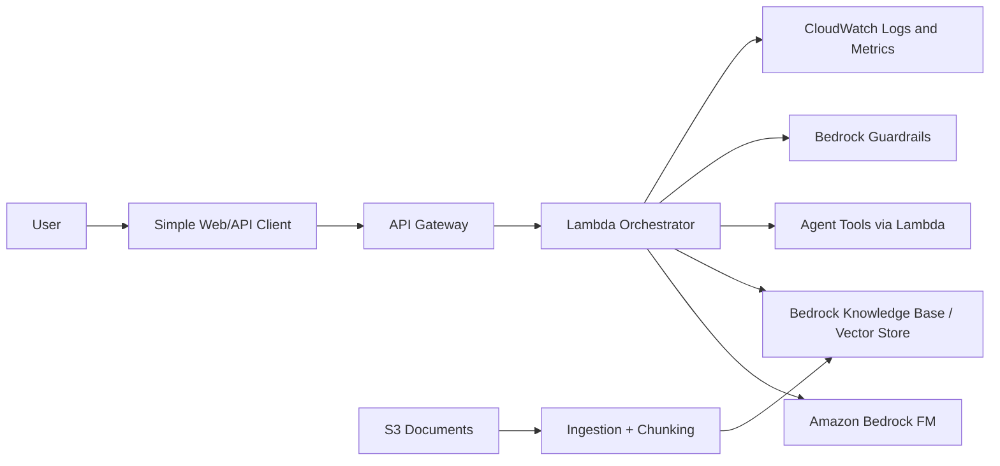

# Capstone Project Architecture

## Tên Project

AWS GenAI Knowledge Assistant

## Mục Tiêu

Xây một trợ lý AI có khả năng trả lời dựa trên tài liệu nội bộ, có guardrails, logging, evaluation và agent tool.

Project này phục vụ trực tiếp cho AIP-C01, sau đó mở rộng sang MLA-C01.

## Kiến Trúc Tổng Thể

## Thành Phần

### 1. Document Store

Dùng S3 để lưu PDF, Markdown, text hoặc CSV.

Cần học:

- Bucket policy.
- Encryption.
- Prefix theo data domain.
- Versioning nếu cần rollback tài liệu.

### 2. Ingestion Pipeline

Chức năng:

- Lấy tài liệu từ S3.
- Tách chunk.
- Tạo embedding.
- Lưu vào vector store hoặc Bedrock Knowledge Base.

Cần học:

- Chunk size và overlap.
- Metadata.
- Data quality.
- Re-ingestion khi tài liệu thay đổi.

### 3. Retrieval Layer

Chức năng:

- Nhận câu hỏi.
- Tìm các chunk liên quan.
- Đưa context vào prompt.

Cần học:

- Top-k retrieval.
- Hybrid search nếu có.
- Citation/source grounding.
- Cách giảm hallucination.

### 4. Generation Layer

Chức năng:

- Gọi foundation model qua Amazon Bedrock.
- Tạo câu trả lời có căn cứ.
- Xử lý fallback khi context yếu.

Cần học:

- Model selection.
- Prompt template.
- Temperature/top-p.
- Token limit.
- Retry và timeout.

### 5. Agent Tools

Ví dụ tool:

- `search_policy_document`
- `calculate_exam_readiness`
- `get_learning_plan_by_week`

Cần học:

- Lambda action group.
- Input/output schema.
- Permission boundary.
- Tool error handling.

### 6. Safety And Governance

Chức năng:

- Guardrails.
- PII handling.
- Prompt injection defense.
- Audit logging.

Cần học:

- IAM least privilege.
- KMS encryption.
- CloudWatch logging.
- Responsible AI evaluation.

### 7. Observability

Theo dõi:

- Latency.
- Token/cost estimate.
- Retrieval hit rate.
- Error rate.
- User feedback.
- Hallucination cases.

## Milestone Project

### Milestone 1: Local Prototype

Input document local, chunking local, gọi Bedrock, trả lời từ context.

### Milestone 2: AWS RAG MVP

Tài liệu trên S3, retrieval qua Knowledge Base/vector store, API qua Lambda.

### Milestone 3: Agent MVP

Thêm ít nhất 2 tool qua Lambda.

### Milestone 4: Safety And Evaluation

Thêm guardrails, eval dataset, CloudWatch logs.

### Milestone 5: Portfolio Package

Viết README project, architecture diagram, cost notes, security notes, lessons learned.

## Mở Rộng Cho MLA-C01

Sau khi xong AIP-C01, thêm module ML:

- Dataset mẫu trong S3.
- SageMaker training job.
- Model Registry.
- Endpoint deployment.
- CloudWatch monitoring.
- Batch transform hoặc real-time inference.
