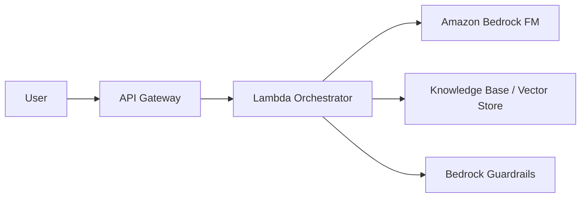

# Tài Liệu Tiếng Việt 04 - Amazon Bedrock Overview

Nguồn chính thức: https://docs.aws.amazon.com/bedrock/latest/userguide/what-is-bedrock.html

Ngày tạo tài liệu học: 2026-06-17

Mục đích: Chuyển tổng quan Amazon Bedrock thành tài liệu nền tảng cho Day 1 và project AWS GenAI Knowledge Assistant.

## 1. Amazon Bedrock Là Gì?

Amazon Bedrock là dịch vụ managed của AWS cho phép truy cập an toàn, cấp doanh nghiệp đến các foundation models hiệu năng cao từ nhiều nhà cung cấp AI.

Nói đơn giản:

- Bạn không cần tự vận hành hạ tầng model.
- Bạn có thể gọi model qua API.
- Bạn có thể xây ứng dụng generative AI trên AWS.
- Bedrock phù hợp cho chatbot, RAG, agents, summarization, content generation, reasoning và automation.

## 2. Vai Trò Của Bedrock Trong AIP-C01

Bedrock là trọng tâm của nhiều chủ đề AIP-C01:

- Foundation model integration.
- Model invocation.
- Prompt engineering.
- RAG/Knowledge Bases.
- Agents.
- Guardrails.
- Evaluation.
- Cost/performance optimization.

Ngày 1 chưa cần code Bedrock sâu, nhưng cần hiểu Bedrock là nền tảng cho phần lớn project.

## 3. Models Được Hỗ Trợ

Bedrock hỗ trợ hơn 100 foundation models từ nhiều nhà cung cấp. Tại thời điểm đọc tài liệu, AWS nêu các nhóm/nhà cung cấp như:

- Amazon Nova.
- Anthropic Claude.
- DeepSeek.
- Moonshot AI/Kimi.
- MiniMax.
- OpenAI.

Ghi chú: danh sách model thay đổi theo thời gian và theo region. Khi làm lab, cần kiểm tra model access trong AWS Console.

## 4. Các Cách Gọi Bedrock

Bedrock có thể được gọi qua nhiều API/SDK:

- Messages API.
- Responses API.
- Chat Completions API.
- Converse API.
- InvokeModel API.

Trong lộ trình này:

- Day 1: hiểu các lựa chọn API.
- Day 5: gọi model lần đầu.
- Tuần 2: dùng Bedrock trong RAG.
- Tuần 3: dùng Bedrock với agents/tools.

## 5. Vị Trí Trong Project AWS GenAI Knowledge Assistant

Bedrock sẽ đảm nhận:

- Sinh câu trả lời dựa trên context.
- Xử lý prompt.
- Hỗ trợ agentic workflow nếu dùng Bedrock Agents.
- Kết hợp guardrails để giảm rủi ro nội dung.

## 6. Điều Cần Biết Về Region Và Model Access

Trước khi lab:

- Chọn region có Bedrock.
- Kiểm tra model bạn muốn dùng có available trong region đó không.
- Kiểm tra account có quyền model access chưa.
- Ghi lại modelId dùng cho lab.

Ví dụ trong tài liệu AWS có thể dùng `us-east-1`, nhưng bạn cần xác nhận với tài khoản của mình.

## 7. Góc Nhìn Security

Khi gọi Bedrock:

- Không dùng root credentials.
- Dùng IAM role/user có quyền tối thiểu.
- Chỉ cấp quyền invoke model cần dùng.
- Nếu đọc dữ liệu từ S3, giới hạn bucket/prefix.
- Ghi log cẩn thận, tránh log PII/secrets.

## 8. Câu Hỏi Ôn Tập

1. Amazon Bedrock giải quyết vấn đề gì?
2. Vì sao Bedrock phù hợp với AI developer thay vì tự host model?
3. Model access có phụ thuộc region không?
4. Trong project RAG, Bedrock nằm ở bước nào?
5. Những thành phần nào của AIP-C01 liên quan trực tiếp đến Bedrock?

## 9. Bài Tập

Viết vào notes:

- Region dự kiến dùng cho Bedrock lab.
- 2 model muốn thử trong Bedrock.
- Lý do chọn model đó.
- Quyền IAM tối thiểu có thể cần cho bước gọi model đầu tiên.
